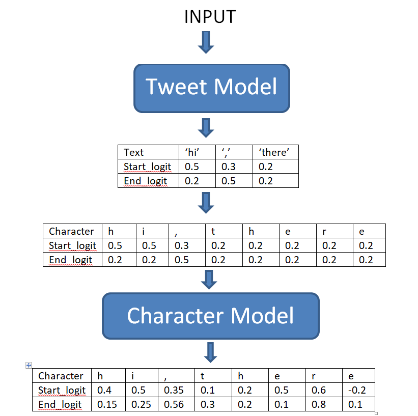

# Lstm_After_roBERTa
A character level prediction after roberta model to make the model learn about post-processing in Question Answering task.

#### Hello Everyone.
I implemented this idea while working on [Kaggle - Tweet Sentiment Extraction](https://www.kaggle.com/c/tweet-sentiment-extraction) competition.

Here is the complete workflow with an example:

The Tweet Model is actually modified roberta for Q/A task.

I have taken some help from [here.](https://www.kaggle.com/shoheiazuma/tweet-sentiment-roberta-pytorch)

You can find the necessary files for roberta model [here.](https://www.kaggle.com/abhishek/roberta-base)

The file I used for training can be found [here.](https://drive.google.com/file/d/1vOa7wP85TBM8h1enf3ElzMqY5cbaXtxd/view?usp=sharing)

Character level dictionary is [here.](https://drive.google.com/file/d/1PIELbJThdiGTk-MFwENsDiFtwv76keDx/view?usp=sharing)
